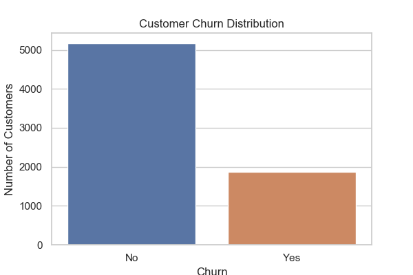
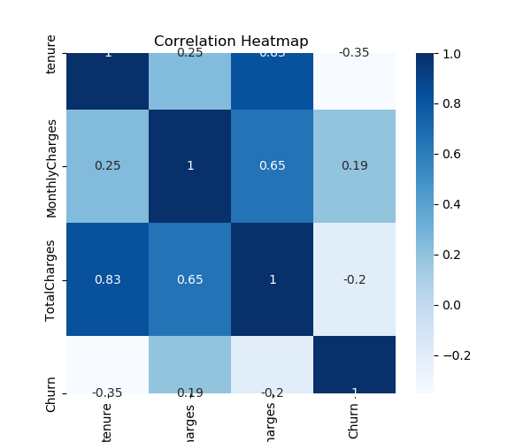
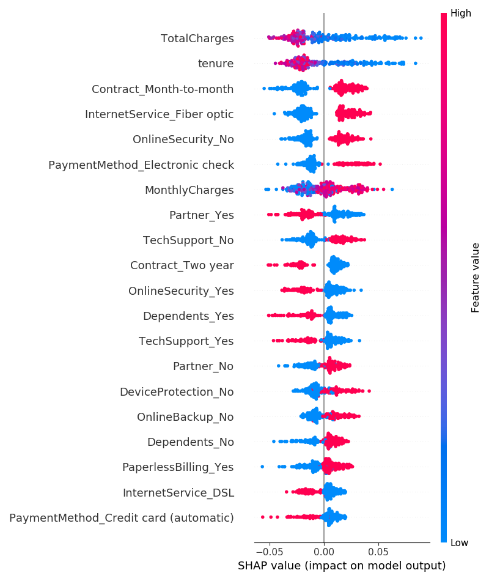

# Customer Churn Prediction & Lifetime Value (LTV) Engine

## Project Overview

Customer churn is one of the biggest challenges faced by telecommunication companies. Losing existing customers directly affects business revenue and customer satisfaction. This project develops a machine learning solution to predict customer churn and estimate Customer Lifetime Value (LTV), helping businesses identify customers who are likely to leave and estimate their future value.

The project uses the Telco Customer Churn dataset and applies data preprocessing, feature engineering, machine learning models, explainability techniques, and model evaluation to build an intelligent customer analytics system.

---

## Objectives

- Predict whether a customer is likely to churn.
- Estimate Customer Lifetime Value (LTV).
- Compare multiple machine learning models.
- Identify important factors affecting customer churn.
- Improve business decision-making using predictive analytics.

---

## Dataset Description

**Dataset:** Telco Customer Churn Dataset

The dataset contains customer information collected from a telecommunications company.

### Features include:

- Customer ID
- Gender
- Senior Citizen
- Partner
- Dependents
- Tenure
- Phone Service
- Multiple Lines
- Internet Service
- Online Security
- Online Backup
- Device Protection
- Tech Support
- Streaming TV
- Streaming Movies
- Contract Type
- Paperless Billing
- Payment Method
- Monthly Charges
- Total Charges
- Churn (Target Variable)

### Additional Features Created

- AvgMonthlySpend
- IsLongTerm
- Lifetime Value (LTV)

---

# Technologies Used

## Programming Language

- Python 3.7

## Libraries

- Pandas
- NumPy
- Matplotlib
- Seaborn
- Scikit-learn
- XGBoost
- SHAP
- Joblib

## Development Environment

- Visual Studio Code
- Jupyter Notebook
- Git
- GitHub

---

# Project Folder Structure

```
Zaalima-Data-Analytics-Project
│
├── app.py
├── README.md
├── requirements.txt
│
├── data
│   ├── raw
│   └── cleaned
│
├── models
│   ├── best_model.pkl
│   └── ltv_model.pkl
│
├── notebooks
│   ├── 02_eda_visualization.ipynb
│   └── customer_churn_prediction_final.ipynb
│
├── reports
│   ├── churn_distribution.png
│   ├── correlation_heatmap.png
│   ├── logistic_regression_confusion_matrix.png
│   ├── random_forest_confusion_matrix.png
│   ├── xgboost_confusion_matrix.png
│   ├── feature_importance.png
│   ├── shap_summary.png
│   ├── model_comparison.csv
│   └── model_comparison.png
│
└── src
```

---

# Installation Steps

## Step 1

Clone the repository

```bash
git clone https://github.com/Asritha-708/Zaalima-Data-Analytics-Project.git
```

---

## Step 2

Go to the project folder

```bash
cd Zaalima-Data-Analytics-Project
```

---

## Step 3

Install dependencies

```bash
pip install -r requirements.txt
```

---

## Step 4

Launch Jupyter Notebook

```bash
jupyter notebook
```

Open

```
customer_churn_prediction_final.ipynb
```

---

# Data Preprocessing

The following preprocessing steps were performed:

- Removed unnecessary columns
- Checked missing values
- Converted categorical variables into numerical values
- Feature Engineering
- One-Hot Encoding
- Train-Test Split
- Data Validation

---

# Exploratory Data Analysis (EDA)

The following visualizations were created:

- Customer Churn Distribution
- Contract Type Distribution
- Monthly Charges Distribution
- Correlation Heatmap
- Feature Importance Plot
- SHAP Summary Plot

These visualizations help understand customer behavior and important features affecting churn.

---

# Machine Learning Models

The following models were implemented:

## Logistic Regression

A baseline classification model used for customer churn prediction.

## Random Forest

An ensemble learning model using multiple decision trees.

## XGBoost

A gradient boosting algorithm providing high predictive performance.

---

# Model Performance

| Model | Accuracy | Precision | Recall | F1 Score |
|-------|----------|-----------|--------|----------|
| Logistic Regression | 80.91% | 67.44% | 54.28% | 60.15% |
| Random Forest | 79.21% | 64.31% | 48.66% | 55.40% |
| XGBoost | 77.71% | 59.32% | 51.07% | 54.89% |

### Best Model

**Logistic Regression** achieved the highest overall performance for this dataset with an accuracy of **80.91%**.

---

# Feature Importance

Random Forest Feature Importance was used to identify the most influential variables affecting customer churn.

Important features include:

- Contract Type
- Tenure
- Monthly Charges
- Total Charges
- Internet Service
- Payment Method

These features contribute significantly to predicting customer churn.

---

# SHAP Explainability

SHAP (SHapley Additive exPlanations) was used to explain model predictions.

Benefits of SHAP:

- Improves model transparency.
- Shows feature contribution for each prediction.
- Helps businesses understand why a customer is predicted to churn.
- Supports explainable Artificial Intelligence (XAI).

---

# Lifetime Value (LTV) Prediction

Customer Lifetime Value (LTV) was calculated using customer tenure and monthly charges.

A regression model was developed to estimate future customer value.

This helps businesses:

- Identify high-value customers.
- Improve customer retention strategies.
- Increase long-term profitability.

- 

---

# Business Impact

The developed system helps telecommunication companies to:

- Predict customer churn before customers leave.
- Understand important churn factors.
- Estimate customer lifetime value.
- Improve customer retention.
- Reduce revenue loss.
- Support data-driven business decisions.

---

# 

---

# Results

The machine learning models were evaluated using Accuracy, Precision, Recall, and F1 Score.

| Model | Accuracy | Precision | Recall | F1 Score |
|-------|----------|-----------|--------|----------|
| Logistic Regression | 80.91% | 67.44% | 54.28% | 60.15% |
| Random Forest | 79.21% | 64.31% | 48.66% | 55.40% |
| XGBoost | 77.71% | 59.32% | 51.07% | 54.89% |

---

## Churn Distribution



---

## Correlation Heatmap



---

## SHAP Summary Plot



---

## Logistic Regression Confusion Matrix


---
Business Outcome

This project helps businesses

- Reduce customer churn
- Improve customer retention
- Identify high-value customers
- Improve marketing strategies
- Increase customer lifetime revenue

- ## Power BI Dashboard

The dashboard provides insights into customer churn by visualizing:

- Total Customers
- Churned Customers
- Churn Rate
- Customer Distribution
- Monthly Charges Analysis
- Tenure Analysis
- Contract Type
- Payment Method
- Internet Service
- Interactive Filters (Slicers)

### Dashboard Status
🚧 In Progress
## Power BI Dashboard

The project includes an interactive Power BI dashboard that provides:

- Total Customers
- Churned Customers
- Active Customers
- Churn Rate
- Average Monthly Charges
- Churn by Contract Type
- Churn by Internet Service
- Churn by Payment Method
- Interactive Filters (Slicers)

Upcoming:
- KPI Cards
- Churn Prediction Summary
- Executive Dashboard

- 
# Contributors

**Asritha Buddi**

B.Tech – Computer Science and Engineering

CMR Institute of Technology

GitHub:
https://github.com/Asritha-708

LinkedIn:
https://www.linkedin.com/in/asritha-buddhi-97616b292

---

# License

This project is developed for educational and internship purposes.

---

## Thank You

Thank you for visiting this project.

If you found this project useful, consider giving it a ⭐ on GitHub.
